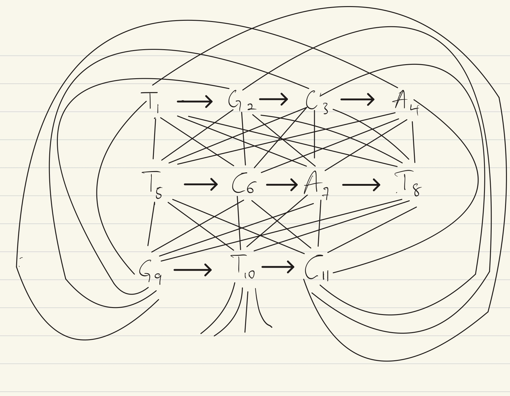
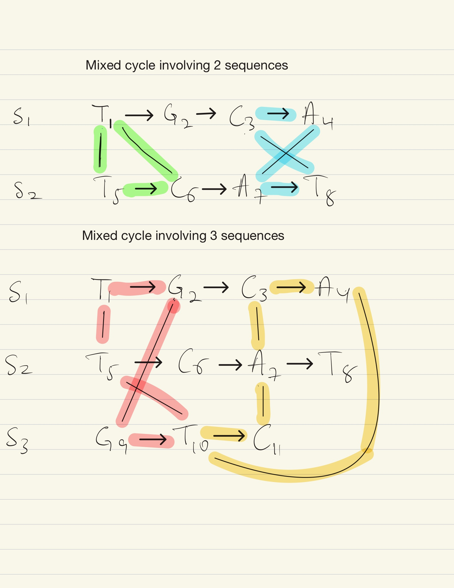

# Sequence-Bioinfo-Ass-03

# Task 6
Show how to interpret the output of the ILP solver; draw the extended alignment graph and indicate chosen
edges, and also draw the associated multiple-sequence alignment.

**Answer**

# Task 7

Draw the extended alignment graph for the following three sequences. List four different simple mixed cycles, of which two involve only two sequences and two involve all three sequences.

## Sequences

- **S1:** T₁ G₂ C₃ A₄  
- **S2:** T₅ C₆ A₇ T₈  
- **S3:** G₉ T₁₀ C₁₁  

## Task

1. Draw the **extended alignment graph** for the sequences above.
2. Identify **four different simple mixed cycles**:
   - Two cycles involving **only two sequences**.
   - Two cycles involving **all three sequences**.

**TASK 7.1 Answer**

**Tast 7.2 answer**

